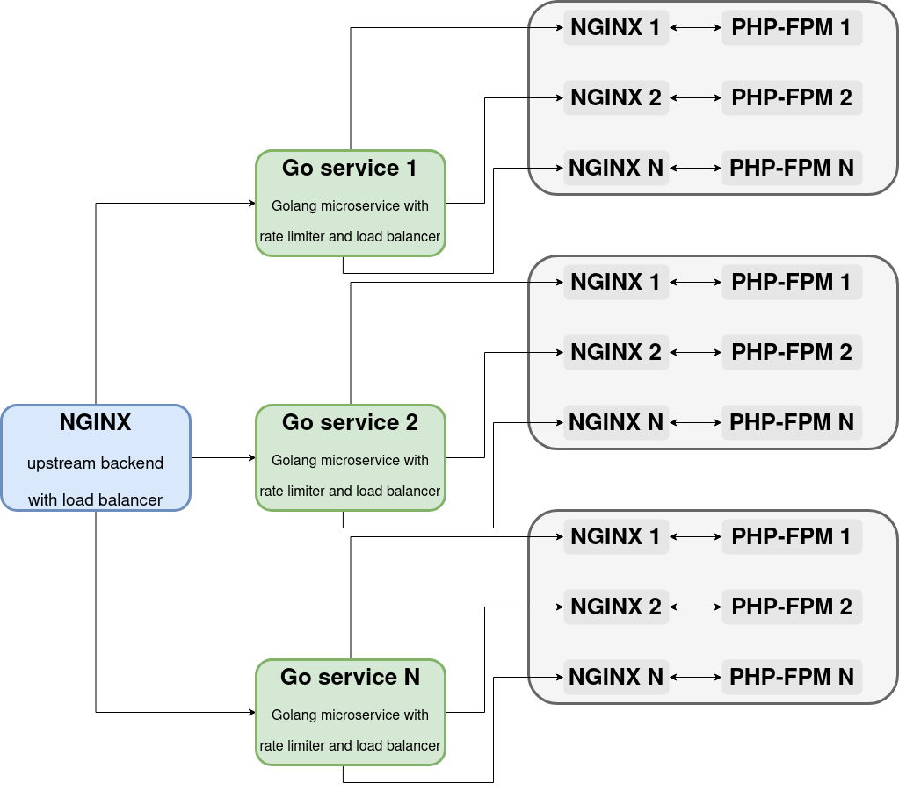

# Balancer nginx-go-php-fpm 

### Архитектура приложения


### Общие положения

Разработать образ Docker, включающий сервер NGINX, менеджер процессов PHP-FPM и микросервис Golang. Цель - обслуживать страницу PHP "Hello World" с ограничением скорости на уникальную строку агента пользователя. Ограничение скорости должно быть реализовано микросервисом Go поверх менеджера процессов php

### Описание архитектуры
Пользовательский запрос поступает на первый NGINX бекенд (первый слева на схеме), далее запрос с помощью внутреннего балансировщика NGINX (round-robin) Распределяется по несколькимм (в тестовом примере только к одному но есть созможность масштабирования) golang backend микросервису, на котором реализована логика ограничения траффика. 

Golang сервис обладает еще одним балансировщиком, который равномерно распределяет запросы по связкам NGINX+PHP-FPM.

Для использования схемы с множеством golang backend неодходимо наличие централизованного KV хранилища в которое будут поступать данные о useragent and last access time.

### Запуск

Для запуска требуется установленный и настроенный Docker


Запустим сборку контейнера
```
 docker build .
```

После того как контейнер соберется нам нужно узнать его IMAGE ID
```
 docker images
```
Запустим наш образ и привяжем его к нашему порту 80 (при условии что на порт не привязано что-то другое) командой 
```
docker run -p 80:80 <IMAGE ID>
```
Проверим все ли работает
```
 wget http://localhost/
 cat index.html
```
Если результат вывода такой - значит все работает
```
Hello world!
```
### Тестирование
Для тестирование будем использовать wrk

Первое что необходимо - узнать IP нашего контейнера

```
docker ps
docker inspect <CONTAINER ID>
```

Запуск теста 
```
docker run --rm -v /etc/hosts:/etc/hosts \
skandyla/wrk -t5 -c10 -d30  http://<IPAddress>
```

Получим результат
```
Running 30s test @ http://172.17.0.2
  5 threads and 10 connections
  Thread Stats   Avg      Stdev     Max   +/- Stdev
    Latency   721.03us  374.23us   6.82ms   72.94%
    Req/Sec     2.84k   252.41     3.83k    67.07%
  423689 requests in 30.00s, 52.13MB read
  Non-2xx or 3xx responses: 423658
Requests/sec:  14121.37
Transfer/sec:      1.74MB

```